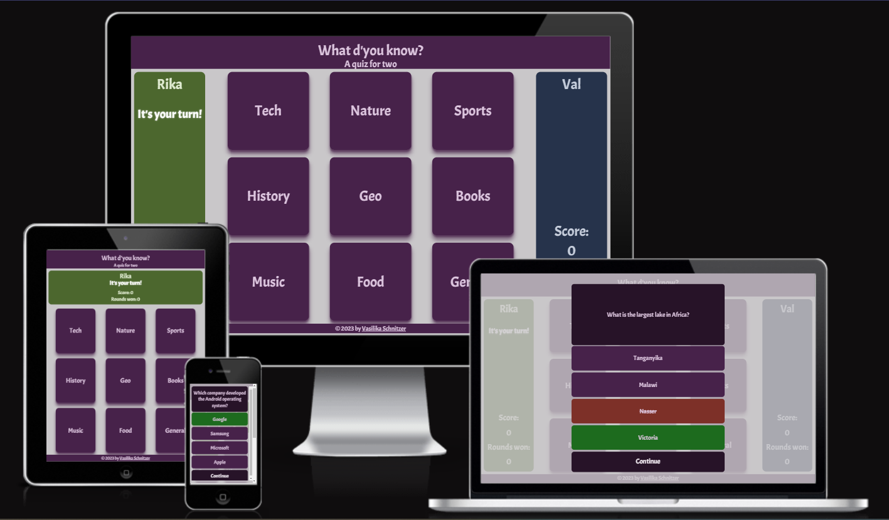
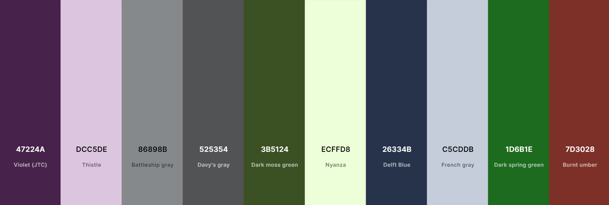

# What d'you know - A Quiz for Two

This project is a website with one page that allows the users to play a trivia quiz game in local multiplayer on one device, thereby testing their general knowledge and learning new facts about the world. 

The website is fully responsive across multiple devices.

## Table of Contents
- [UX](#ux "UX")
    - [Target audience](#target-audience "Target audience")
        - [First-time visitors](#first-time-visitors "First-time visitors")
        - [Returning visitors](#returning-visitors "Returning visitors")
    - [Site goal](#site-goal "Site goal")
- [Design](#design "Design")
    - [Color scheme](#color-scheme "Color scheme")
    - [Typography](#typography "Typography")
    - [Images](#images "Images")
- [Features](#features "Features")
    - [Game loop](#game-loop "Game loop")
    - [Codebase](#codebase "Codebase")
        - [File structure](#file-structure "File structure")
        - [Flowchart](#flowchart "Flowchart")
        - [Mechanics](#mechanics "Mechanics")

    - [Future features](#future-features "Future features")
    - [Known bugs](#known-bugs "Known bugs")
- [Technologies](#technologies "Technologies")
    - [Main Languages](#main-languages "Main Languages")
    - [Frameworks, Libraries, Applications](#frameworks-libraries-applications "Frameworks, Libraries, Applications")
- [Testing](#testing "Testing")
- [Deployment](#deployment "Deployment")
- [Acknowledgments](#acknowledgments "Acknowledgments") 

## UX

### Target audience

The target audience for the game are English-speaking teenagers and adults who enjoy trivia games and want to play against a local human opponent.

#### First-time visitors

First-time visitors are greeted by a welcome screen which contains a short game description - a "How-to-play" - as well as two clearly marked input fields for the player names.

#### Returning visitors

Returning visitors can immediately enter their names on page load without having to re-read the game description.

### Site goal

The site goal is to engage two people in a fun quiz game for an unspecified amount of time and encourage them to come back for even more questions to ruminate on and more new facts to learn.

## Design

### Color scheme

### Typography

### Images

## Features
### Game loop
The questions are split into 9 categories. Players take turns choosing a category and answering a question