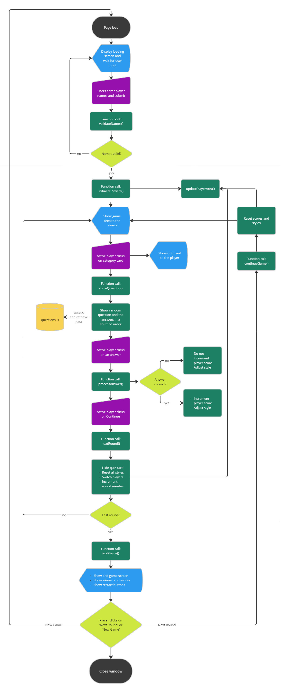

# What d'you know - A Quiz for Two

This project is a website with one page that allows the users to play a trivia quiz game in local multiplayer on one device, thereby testing their general knowledge and learning new facts about the world. 


The website is fully responsive across multiple devices.


## Table of Contents
- [UX](#ux "UX")
    - [Target audience](#target-audience "Target audience")
        - [First-time visitors](#first-time-visitors "First-time visitors")
        - [Returning visitors](#returning-visitors "Returning visitors")
    - [Site goal](#site-goal "Site goal")
- [Design](#design "Design")
    - [Color scheme](#color-scheme "Color scheme")
    - [Typography](#typography "Typography")
    - [Images](#images "Images")
- [Features](#features "Features")
    - [Game loop](#game-loop "Game loop")
    - [Codebase](#codebase "Codebase")
        - [File structure](#file-structure "File structure")
        - [Flowchart](#flowchart "Flowchart")
        - [Mechanics](#mechanics "Mechanics")

    - [Future features](#future-features "Future features")
    - [Known bugs](#known-bugs "Known bugs")
- [Technologies](#technologies "Technologies")
    - [Main Languages](#main-languages "Main Languages")
    - [Frameworks, Libraries, Applications](#frameworks-libraries-applications "Frameworks, Libraries, Applications")
- [Testing](#testing "Testing")
- [Deployment](#deployment "Deployment")
- [Acknowledgments](#acknowledgments "Acknowledgments") 


## UX

### Target audience

The target audience for the game are English-speaking teenagers and adults who enjoy trivia games and want to play against a local human opponent.

#### First-time visitors

First-time visitors are greeted by a welcome screen which contains a short game description - a "How-to-play" - as well as two clearly marked input fields for the player names.

#### Returning visitors

Returning visitors can immediately enter their names on page load without having to re-read the game description.

### Site goal

The site goal is to engage two people in a fun quiz game for an unspecified amount of time and encourage them to come back for even more questions to ruminate on and more new facts to learn.

## Design

When choosing a design for my game, I prioritized clearness and readability to make sure all important information was visible and easily readable to the players at all times and on different screen sizes. At the same time, I chose to implement different colors to give the game a fun and colorful feeling.

The header with the game title and the footer with copyright info are designed to be unobtrusive as to not draw attention away from the main game area.

The layout of the game area is slightly different on mobiles and on larger screens:
 - On mobiles, the area containing the active player name, their score and the note "It's your turn" is displayed at the top. The area of the inactive player is hidden. Below the player area is the card area with two or three columns, depending on the phone size. The dialog with the quiz question that appears after clicking on a card fills the entire phone screen.
 - On larger screens, the card area takes up most space in the middle of the screen and the two player areas are to the left and right of the card area. The dialog with the quiz question only fills a small percentage of the screen. A light, translucent modal fills the space behind it, preventing the user from interacting with the background.

All game elements that are clickable (category cards, answers) have a box shadow that slightly lifts them up from the background. Once they become unclickable, the shadow disappears to convey to the players that they are no longer interactive.

### Color scheme

Since this is a two-player game, each player has their own color that is used in that player's area. Whenever a player answers the question of a specific category card correctly, that card also receives that player's color. Cards whose answers have been answered incorrectly, receive a neutral gray color. That way, the players have an additional clue as to who is leading, beside the score in the player areas.

On the quiz cards, correct answers are highlighted green and wrong answers are highlighted red, which corresponds to the conventional use of color coding for "wrong" and "right". However, since these colors might present a barrier to people with color vision deficiency, the wrong answer is also marked by a line-through.


I chose three main colors for the game area: 
- Violet - header, footer, 9 category cards, quiz card, loading screen, end game screen
- Dark moss green - player 1 background
- Delft blue - player 2 background

Each of those colors has a much lighter equivalent that I use for the text:
- Thistle - for text on Violet
- Nyanza - for text on Dark moss green
- French gray - for text on Delft blue

These color combinations have been checked with the [WebAIM Contrast Checker](https://webaim.org/resources/contrastchecker) to make sure the contrast ratio is sufficient.

The remaining colors are:
- Battleship gray and Davy's gray - for neutral, inactive category cards that cannot be clicked on anymore
- Dark spring green - to highlight correct answers
- Burnt umber - to highlight wrong answers

### Typography

I chose to have a single font for all game elements to make it less confusing. The font used is [Acme](https://fonts.google.com/specimen/Acme), downloaded from [Google Fonts](https://fonts.google.com/).

### Images

I did not use any images in the game due to time restrictions, though I do believe that a few well-placed graphics would improve the overall look-and-feel of the game. This is a consideration for a future update.

## Features
### Game loop

After the webpage has loaded, the user is presented with a loading screen providing a short description of the game and two input fields for the player names. This is where the user starts interacting with the game.

1. The user enters the names of the two players and clicks on "Start".
2. In case the player names are not consistent with the pattern for valid names, a notification is shown to the user explaining the rules for name selection.
3. Once the user has chosen two valid names, the loading screen disappears and the game area becomes visible.
4. The game area consists of 9 cards, each showing the name of a quiz category. The active player, who is marked as such with the string "It's your turn" under their name, selects one category and clicks on it.
5. A quiz card with a random question from the chosen category along with four clickable answers is shown to the player.
6. The player clicks on an answer and receives feedback in form of color coding - green for a correct answer, red for an incorrect answer.
7. Was the answer incorrect, the correct answer is highlighted green.
8. The player clicks on the button "Continue" that is shown in the lower part of the card after an answer has been chosen.
9. The quiz card is hidden and the game area is visible again, this time with the second player marked as active player by the string "It's your turn". The already used category card is colored either in gray (in case of a wrong answer) or in the previous player's color (in case of a correct answer).
10. The game loop continues at step 4 for the second player.
11. The steps 4 to 10 are repeated nine times, until no category cards remain active. At that point, an end game screen is shown to the players that contains the name of the winning player as well as a table with the player names, their respective scores for this round and the amount of total wins so far. Below that information, two buttons allow the players to take action:
    - "Next round" - allows the players to continue at step 4 with new questions and all category cards reset. Their progress will be saved.
    - "New game" - allows the players to restart the game for new players. All progress is lost.

### Codebase

#### File structure

- `index.html` - main HTML file with the game elements
- `error.html` - an error page to be shown in case there is an issue with the database and questions cannot be retrieved
- `assets/css/style.css` - styles for the entire site
- `assets/favicons` - folder containing the site icons
- `assets/images` - folder containing the image files (for now only readme images)
- `assets/js/questions.js` - database file containing nine arrays with question objects for the nine categories as well as an array containing the quiz category names and their respective array lengths 
- `assets/js/script.js` - script file containing the game code

#### Flowchart
<details>
<summary>Flowchart depicting the progression of actions and processes</summary>



</details>

#### Mechanics

**Scope:**

Considering that it is seen as bad practice in JavaScript to have global variables that can accidentally be overwritten, but also having the need for variables that can be accessed by different functions, I decided to declare global objects with the `const` keyword to make sure they cannot be reassigned. Among those objects are `player1` and `player2` that contain all data pertaining to the relevant player as well as the `gameState` object containing all data on the game progress and the current round.

I use the `let` keyword for all variables within functions to keep them in their respective scopes.

**Event handling:**

Event listeners set globally only persist througout the entire game loop if they are constantly needed, as is the case for the event listeners on the 9 category cards. Other event listeners that are required only once or are confined to certain functions are removed as soon as they are no longer needed to prevent unexpected behavior in the game.

**Questions database:**

The file `questions.js` contains the database from which the quiz questions and answers are retrieved. For each of the 9 categories, there is one array contianing multiple objects. The format of the array is as follows:

```
const quizQuestionsCategoryName = [
  {
    question: "Question shown to the player",
    answers: [
      "Correct Answer",
      "Answer b",
      "Answer c",
      "Answer d",
    ],
    correctAnswer: 0,
  },
  ...
  ]
  ```
Additional quiz questions must be added in the exact same format.

The file also contains the array `quizCategories` which is needed to access the correct category array whenever the player clicks on a category card. The format of this array is as folows:
```
const quizCategories = [
  [quizQuestionsCategoryName, quizQuestionsCategoryName.length],
  ...
]
```

The array contains exactly 9 subarrays and their indexes must correspond to the values of the attribute `data-id` of the `div` elements inside the div container `card-area` in `index.html`. For example, since the `div` of the category card "Tech" has the attribute `data-id="0"`, the array `[quizQuestionsTech, quizQuestionsTech.length]` must be found at index 0 of the array `quizCategories` to ensure correct data retrieval.

**Non-repetitive randomness:**

I wanted to make sure that players who play multiple consecutive rounds do not encounter the same question several times (unless, of course, they play more times than there are questions). To that end, I implemented the following process:

Instead of randomly selecting one question from the array and then risking its repeated selection next round, I wanted to select a random index to retrieve the question with and then remove that index from an individual list of indexes pertaining to each category. For that, I needed editable arrays with exactly as many index numbers from 0 to n as there are question objects in the corresponding category array.

The following code takes care of that:

```
const questionKeys = {};
for (let i = 0; i < quizCategories.length; i++) {
  questionKeys[i] = [...Array(quizCategories[i][1]).keys()];
}
```
`quizCategories.length` is 9, since there are 9 categories. `quizCategories[i][1]` is the length of each category array. Using spread syntax, I create 9 subarrays with indexes ranging from 0 to n, where n is the length of each category array minus 1.

Then, in the function `showQuestion()`, I use `Math.random()` to generate a random index for the `questionKeys` array:

```
let randomIndexQ = Math.floor(Math.random() * questionKeys[categoryIndex].length);
```
The question to be shown to the player is chosen based on that index. 

Finally, I have to make sure that the used index number is either removed from the `questionKeys` array, or that the array is reset before there are no more indexes to retrieve:

```
  if (questionKeys[categoryIndex].length === 1) {
    questionKeys[categoryIndex] = [...Array(quizCategories[categoryIndex][1]).keys()];
  } else {
    questionKeys[categoryIndex].splice(randomIndexQ, 1);
  }
```

I use the same method to shuffle the answers on the quiz cards, thus making sure that the correct question is not always shown on top.

**Error handling:**

Since I allow direct user input of a string on my website, I need to make sure that the user doesn't input anything malicious or anything that could break the readability of the page text. Therefore, I implemented two types of checks for the input fields `p1` and `p2`:
 - the attribute `maxlength="10"` in the HTML of the input fields to spare the users the trouble of putting in too many characters before being notified of a limit
 - the function `validateNames()` that tests the input against the `regex` string `/^[a-zA-Z0-9._-]{1,10}$/`, allowing only latin letters, numbers and the characters `._-`

 The game displays the loading screen for as long as the input is invalid and only proceeds to `initializePlayers()` once it has received valid player names. The players are notified of the requirements on the loading screen.

Another grave error that would make the game unplayable is a corrupted database. Whenever the script tries to access data from the database file `questions.js`, it runs through a `try ... catch` process:

```
try {
  ...
} catch {
  self.location = "error.html";
}
```
If
- the script file `questions.js` is inaccessible,
- the array `quizCategories` in that file contains incorrect values,
- or the arrays containing questions and answers for one or more quiz category are missing or empty,

then the page `error.html` is loaded, notifying the user of the issue and suggesting to contact the dev or to try and reload the index page.

In case there are fewer or more answers in the answer array of the active question object or if the key `question` is missing,  